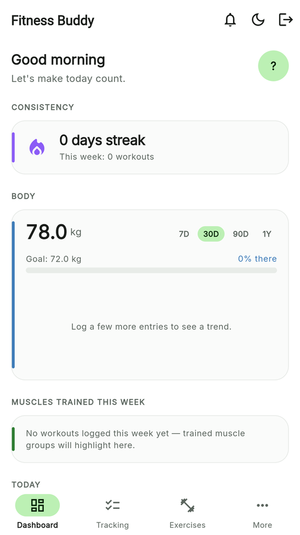
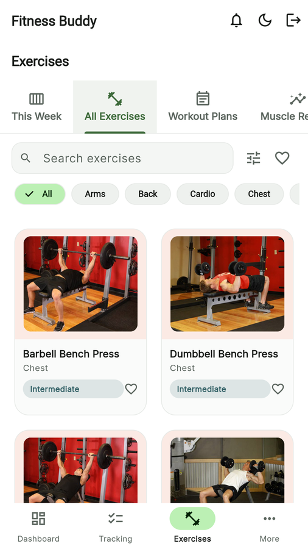
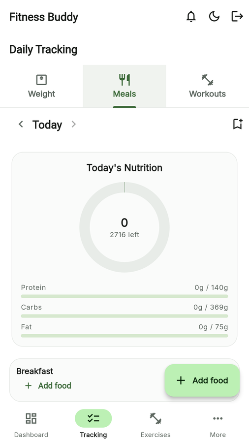

<p align="center">
  
</p>

<h1 align="center">Fitness Buddy</h1>

<p align="center">
  A Flutter (web-first, also Android/iOS) app for tracking body transformation and fitness
  progress — workouts, nutrition, weight, and expenses — backed by Firebase.
</p>

<p align="center">
  <a href="https://github.com/vaibhavhariramani/fitness_buddy/actions/workflows/ci-cd.yml">
    
  </a>
  <a href="https://fitness-buddy.web.app">
    
  </a>
</p>

**Live demo:** [fitness-buddy.web.app](https://fitness-buddy.web.app)

## Screenshots

> Add your own screenshots here — drop PNGs into `docs/screenshots/` using the file names below
> and they'll render automatically.

| Dashboard | Exercise Library | Nutrition Tracker | Active Workout |
|---|---|---|---|
|  |  |  |  |

## Features

### Onboarding & Auth
- Email/password and Google sign-in, forgot-password flow
- Onboarding collects weight, height, target weight, age, gender, and activity level, then computes BMI, TDEE, and calorie/macro targets (Mifflin-St Jeor)

### Dashboard
- Day streak, current/target weight, and personal-record stat cards (responsive grid)
- Weight trend chart and all-time muscle-group volume chart
- Weekly summary (average weight, trend direction)

### Exercise Library & Workout Coach
- 70-exercise offline catalog — category, primary/secondary muscles, equipment, difficulty, preparation/execution instructions, form tips, common mistakes, safety notes, and substitute suggestions
- Real exercise photos (wger.de, CC BY-SA 4.0) for the most common exercises, with a hand-drawn pose illustration fallback for the rest — cached on-device for offline use
- Muscle-group anatomy diagrams
- Workout Plans — build, reorder, duplicate, and start guided sessions from a plan
- Muscle Reports — weekly/monthly training volume per muscle group with recovery status
- "Replace exercise" substitution sheet, "Add to workout" quick action

### Workout Logging
- Ad-hoc logging with an exercise-name autocomplete backed by the catalog (auto-fills muscle group)
- Guided "Start Workout" session: rest timer, previous-performance display, RIR tracking, warm-up/failure set flags, automatic PR detection (Epley estimated 1RM)
- Date picker on every logging entry point (defaults to today, supports backdating)

### Nutrition Tracker
- Food search backed by Open Food Facts, plus barcode scanning
- A small bundled "Common foods" list (plain oats, oats + whey protein, chicken curry, boiled rice) that's always available even when Open Food Facts has no generic match or is unreachable, with quick gram/serving-size presets
- Quick Add (manual macros), Saved Meals (batch logging), user-created Recipes with live per-serving macro calculation, Custom Foods, Favorites, and a Recent-foods list derived from history
- Editable macros on the logging screen — override calculated values with exact figures from a label
- Daily targets ring + macro progress bars, 6 meal types, date picker for backdating

### Expenses, Diet Plan & Recipes
- Expense tracker with category-wise totals, bar charts, and date picker
- Rule-based diet suggestion (calorie/macro plan derived from TDEE)
- "Cook This" — ingredient-overlap recipe matching against a seeded recipe set

### Social
- Friend requests, privacy-gated shared progress, 1:1 and group chat

### Platform polish
- Light/dark theme, mobile-first responsive layout (curated bottom nav + "More" sheet on phones), pill buttons, hairline-bordered cards, and the Inter typeface — see `lib/app/theme.dart`

## Tech stack

- **Flutter** (Web, Android, iOS) with **Riverpod** (hand-written `StateNotifier`s) for state management
- **go_router** for navigation
- **Firebase**: Authentication, Firestore, Storage, Hosting (no Cloud Functions)
- **fl_chart** for charts, **mobile_scanner** for barcode scanning, **cached_network_image** for offline-friendly image caching, **Hive** for local favorites/recents

## Architecture

Feature-first structure under `lib/features/<feature>/`. Two model/data conventions coexist by design:

- **Flat**: `lib/models/` + `lib/services/repositories/` for cross-feature, persisted data (expenses, workouts, weight, meals, workout plans, custom foods, etc.)
- **Nested**: `lib/features/<feature>/{models,repository,providers,pages,widgets}` for feature-internal types (the exercise catalog, food search models)

Firestore is organized as per-user subcollections under `users/{uid}/...`, gated by security rules in `firestore.rules`.

## Getting started (local development)

```bash
flutter pub get
flutterfire configure   # generates lib/firebase_options.dart for your own Firebase project
flutter run -d chrome
```

## Testing

```bash
flutter analyze          # static analysis
dart format --output=none --set-exit-if-changed .   # format check
flutter test              # unit tests (calculations, streaks, PR detection)
```

## Deployment

The web app deploys to a dedicated Firebase Hosting site (target `fitness-buddy`) inside the `expense-tracker-71917` Firebase project:

```bash
flutter build web
firebase deploy --only hosting:fitness-buddy --project expense-tracker-71917
```

## CI/CD

`.github/workflows/ci-cd.yml` runs on every push/PR to `main` with four stages:

1. **Scan code** — `flutter analyze`, `dart format --set-exit-if-changed`, and a secret scan ([gitleaks](https://github.com/gitleaks/gitleaks-action))
2. **Build app** — `flutter build web --release`, uploaded as a build artifact
3. **Smoke test** — `flutter test` (unit tests covering BMI/TDEE calculations, streak logic, and PR detection)
4. **Deploy** — deploys the built artifact to Firebase Hosting (`fitness-buddy` site), **only on pushes to `main`**, after scan/build/test all pass

### One-time setup: Firebase deploy secret

The deploy stage needs a repo secret named `FIREBASE_SERVICE_ACCOUNT`:

1. Firebase Console → Project Settings → Service Accounts → **Generate new private key** (for project `expense-tracker-71917`)
2. GitHub repo → Settings → Secrets and variables → Actions → **New repository secret**
3. Name: `FIREBASE_SERVICE_ACCOUNT`, value: the full contents of the downloaded JSON key

Until that secret is added, the `scan`/`build`/`smoke-test` stages will still run and pass — only the final `deploy` stage will fail.
